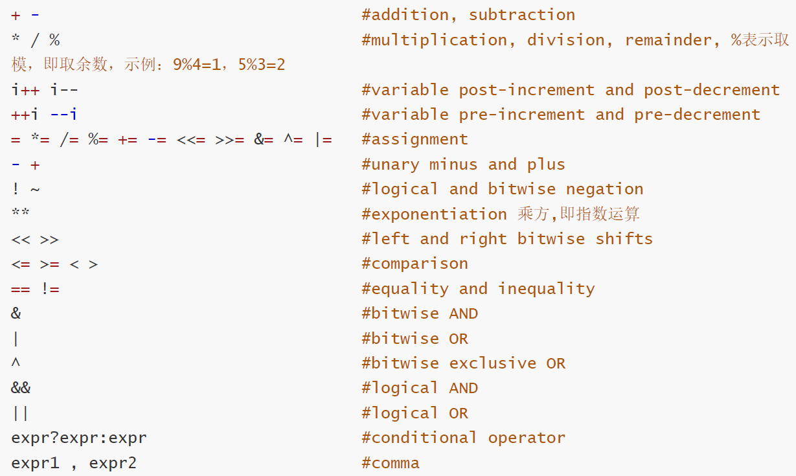
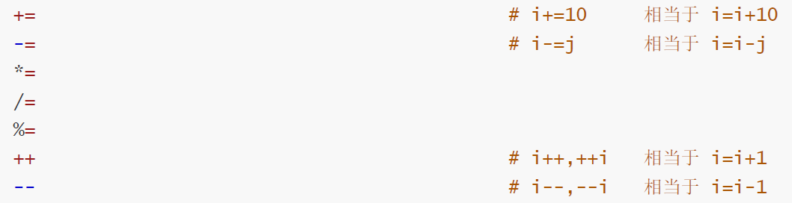
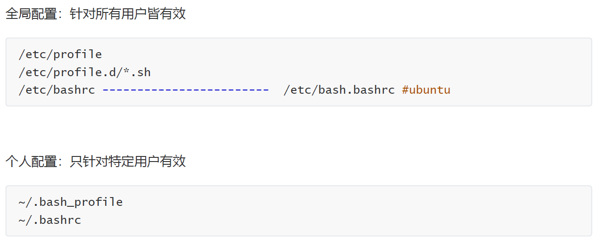
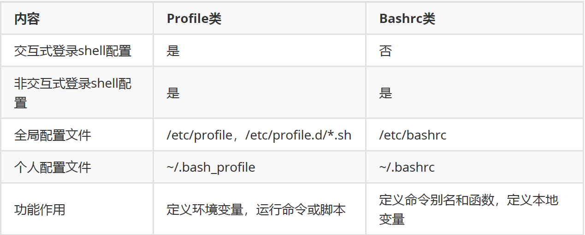

# 编程基础

## 程序组成

- 程序
- 算法
- 数据结构
- 数据

## 编程语言风格

- 面向过程
- 面向对象

## 编程语言

- 低级语言
- 高级语言

## 编程逻辑处理方式

- 顺序
- 分支
- 循环

# shell脚本语言基础用法

## shell脚本的用途

提高效率

减少手工输入避免错误

软件应用的安装及配置标准化

实现日常目的性的重复性的非交互运维工作

## shell脚本的基本结构

shell是过程式的解释执行的语言

shell脚本是包含命令或声明，并符合一定格式的脚本文件

设立了脚本文件组成包含

- 命令
- 数据存储
- 表达式
- 控制语句

shebang机制

```
#!/bin/bash

```

## shell脚本的创建过程

1. 创建文件，首行必须是shell声明
2. 添加可执行权限
3. 运行脚本

## shell脚本的注释规范

一般要注明作者，创建（修改）时间，文件名，版本号，该程序的功能及作用，目地，版权信息，作者联系方式等

配置vim 自动生成注释

```
vim .vimrc

set nu
set ts=4
autocmd BufNewFile *.sh exec ":call SetTitle()"
func SetTitle()
  if expand("%:e") == 'sh'
    call setline(1,"#!/bin/bash")
    call setline(2,"#")
    call setline(3,"#****************************************************")
    call setline(4,"#Author: ethan")
    call setline(5,"#QQ: 964297818")
    call setline(6,"#Date: ".strftime("%Y-%m-%d"))
    call setline(7,"#FileName: ".expand("%"))
    call setline(8,"#Copyright(C): ".strftime("%Y")." All right")
    call setline(9,"#***************************************************")
    call setline(10,"")
    call setline(11,"")
    call setline(12,"")
  endif
endfunc
autocmd BufNewFile * normal G
```

行首加#用于注释

## HelloWorld

本地执行远程脚本

远程主机执行本地脚本

## shell脚本调试

```
bash
  -n 检测语法错误
  -x 逐行执行并输出执行结果
```

语法错误导致后续不执行

命令错误后续执行

逻辑错误

## 变量

### 变量类型

### 程序语言分类

### shell变量命名法则

命名规则

- 区分大小写
- 不能使用保留字
- 只能使用字母数字下划线，不能数字开头

命名习惯

- 见名知义
- 变量大写
- 局部变量小写
- 函数名小写
- 大小驼峰

### 变量定义和使用

- 普通变量 当前进程中生效
- 环境变量 当前进程和子进程生效，可被子进程继承
- 本地变量 当前进程中代码片段中生效

```
. abc.sh当前进程执行
./abc.sh当前进程子进程执行
```

```
set 定义变量
unset 销毁变量
```

### 环境变量

```
export
declare -x
```


### 只读变量

```
readonly
declare -r
```

只能声明定义，但后续不能修改和删除，即常量

### 位置变量

```
$1,$2,... 对应第1个、第2个等参数，shift [n]换位置
$0 命令本身,包括路径
$* 传递给脚本的所有参数，全部参数合为一个字符串
$@ 传递给脚本的所有参数，每个参数为独立字符串
$# 传递给脚本的参数的个数
```

在bash shell中内置的变量, 在脚本代码中调用通过命令行传递给脚本的参数

### 链接实现执行不同命令

```
[root@ubuntu2204 ~]# cat test.sh
#!/bin/bash
#********************************************************************
echo $0
[root@ubuntu2204 ~]# ln -s test.sh a.sh
[root@ubuntu2204 ~]# ln -s test.sh b.sh
[root@ubuntu2204 ~]# ./a.sh
./a.sh
[root@ubuntu2204 ~]# ./b.sh
./b.sh
```

### 退出状态码

0表示成功

1~255表示失败

一旦遇到exit命令，脚本立即终止

没有给状态码取决于最后一条命令执行状态

使用以下命令自定义退出状态码

```
exit [n]
```

### 展开命令行

```
'' 不允许展开防止所有扩展
"" 也可防止扩展，但是以下情况例外 $
$() 和 ``命令替换
\ 使随后的字符按原义解释
```

变量用""

命令用$()或``

### 脚本安全

```
set 用来定制 shell 环境
  -u 在扩展一个没有设置的变量时，显示错误信息
  -e 如果一个命令返回一个非0就退出
  -o option 显示，打开或者关闭选项
```

## 格式化输出printf

### 格式替换符

```
%s 字符串
%d,%i 十进制整数
%f 浮点格式
%o 八进制值
%u 无符号十进制值
%x 十六进制值（a-f）
%X 十六进制值（A-F）
%% %本身
```

### 转义字符

```
\a 警告字符，通常为ASCII的BEL字符
\b 退格
\n 换行
\r 回车
\t 水平制表符
\v 垂直制表符
\ \本身
```

## 算数运算



```
$RANDOM 生成随机数
$[$RANDOM%50] 生成0~49的随机数
```



```
let a=
```

## 逻辑运算

- 与
- 或
- 非

### 异或

异或可实现不使用额外空间交换两个变量数据

```
[root@ubuntu2204 ~]# x=10;y=20;temp=$x;x=$y;y=$temp;echo x=$x,y=$y
x=20,y=10
[root@ubuntu2204 ~]# x=10;y=20;x=$[x^y];y=$[x^y];x=$[x^y];echo x=$x,y=$y
x=20,y=10
```

#### 短路运算

Bash和其他shell中，&&和||具有相同的优先级。具有相同优先级的运算符是左结合的。

cmd1 || cmd2 && cmd3 这种语法是错误的，不使用；

## 条件测试

```
test 
[ arg... ] #同 test
[[ expression ]] #增加版的[],支持[],支持扩展正则表达式和通配符
```

### 变量测试

```
test -v x 测试变量是否存在
[ -v name ] 左右需有空格否则报错
```

### 数值测试

```
数字相关 格式 arg1 OP arg2
  -eq 等于
  -ne 不等于
  -lt 小于
  -le 小于等于
  -gt 大于
  -ge 大于等于
算术表达式
  == 相等
  != 不相等
  <= 小于或等于
  >= 大于或等于
  < 小于
  > 大于
```

### 字符串测试

#### test和 [ ] 字符串测试用法

```
-z STRING 是否为空，为空则为真
-n STRING 不为空则为真
STRING 同上

两个字符串变量比较，一定要有空格，没有空格，就变成赋值
STRING1 = STRING2 string1 和 string2 字符串相同则为真
STRING1 != STRING2 string1 和 string2 字符串不相同则为真
STRING1 < STRING2 一个一个字符比较，以字母表顺序来比较 < 要转义
STRING1 > STRING2 一个一个字符比较，以字母表顺序来比较 > 要转义
```

#### [[ ]] 字符串测试用法

```
[[ expression ]] 用法
== 左侧字符串是否和右侧的PATTERN相同，PATTERN为通配符
=~ 左侧字符串是否能够被右侧的正则表达式的PATTERN所匹配 [[ ]]中为扩展的正则表达式
```

### 文件测试

```
-e /aaa/a.txt 文件是否存在
-d /aaa 目录是否存在
-w 文件是否有写权限，用户实际能否写而非是否有权限，文件没有写权限root也可写
-x 文件是否有执行权限
-s 文件是否存在且非空
-O  是否为文件属主
```

## ()和{}

```
( cmd1;cmd2;... ) 和 { cmd1;cmd2;...; } 都可以将多个命令组合
( list ) 会开启子shell,并且list中变量赋值及内部命令执行后,将不再影响后续的环境
{ list; } 不会开启子shell, 在当前shell中运行,会影响当前shell环境，左侧要有空格，右侧要有;
```

### 组合测试条件

```
[ EXPRESSION1 -a EXPRESSION2 ]
-a 且
-o 或
! 非
```

```
test COMMAND1 && COMMAND2
&& 且
|| 或
! 非
```

source 可写成.

```
[root@rocky ~]# . /etc/os-release; [[ $ID == "rocky" ]] && [[ $VERSION_ID == 8*
]] && echo Rocky8 || echo CentOS8
Rocky8
```

### 使用read命令接受输入

```
read
  -p #指定要显示的提示
  -s #静默输入，一般用于密码
```

管道左右两边都是子进程

# bashshell配置文件

## 按生效范围分

- 全局配置 针对所有用户皆有效
- 个人配置 只针对特定用户有效



## shell登录方式分

### 交互式登录

- 直接通过终端输入账号密码登录
- 使用 su - UserName 切换的用户

### 非交互式登录

- su UserName
- 图形界面下打开的终端
- 执行脚本
- 任何其它的bash实例

## 按功能分



## 编辑配置文件生效

- 重新启动shell进程
- source|. 配置文件

## Bash退出任务

存在~/.bash_logout文件中,在退出登录shell时运行可用于创建自动备份和清理临时文件

# 控制流程

## 条件选择

### if

```
if 判断条件;then
  条件为真的分支代码
fi
```

```
if 判断条件; then
  条件为真的分支代码
else
  条件为假的分支代码
fi
```

```
if 判断条件1; then
  条件1为真的分支代码
elif 判断条件2; then
  条件2为真的分支代码
elif 判断条件3; then
  条件3为真的分支代码
  ...
else
  以上条件都为假的分支代码
fi
```

### case

case支持通配符

```
case 变量引用 in
PAT1)
  分支1
  ;;
PAT2)
  分支2
  ;;
  ...
*)
  默认分支
  ;;
esac
```

## 循环