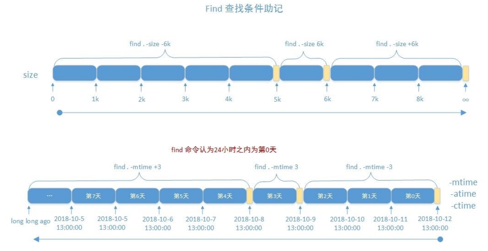

# 文件查找

非实时查找（数据库）

实时查找

## locate

```
locate
  -b 仅文件名
  -c 显示数量
  -n N 显示前N条
  -r 正则表达式
  -d 指定数据库
updatedb
```

## find

- 查找慢
- 精确查找
- 实时查找
- 只搜索有权限目录

```
find
  -name 文件名
  -iname 忽略大小写文件名
  -regex 正则表达式
  -inode inode号
  
  -user 属主
  -group 属组
  -uid
  -gid
  -nouser 找不到用户
  -nogroup 找不到组
  
  -type 文件类型
  
  -a 与（默认）
  -o 或
  -not 非
  -! 非
  
  -ls 长格式显示，注意前面如果有多个条件需要括号
  -prune 排除指定目录 需要配合-path使用
  -size 设置大小
    10k 表示(9k,10k] 大于9k 且小于或等于10k
    -10k 表示[0k,9k] 大于等于0k 且小于或等于9k
    +10k 表示(10k,∞) 大于10k
  
  -atime
  -mtime
  -ctime
   设置类似size
  -amin
  -mmin
  -cmin
   设置类似size
   
   -perm 权限
      444 权限为444
      /755 user权限有r或w或x权限或者group有r或x权限或者other有r或x权限
      /444 有一个角色权限有r权限即可
      /100 user有x权限即可
      -111 三个角色都要有x权限
      
    -regex 正则表达式
    
    -f 结果保存文件
    -delete 删除
    -exec 执行指令
    -ok 执行命令，执行前确认
    
```



## xargs

xargs接受标准输入 用于无法使用管道或者命令无法接受过多参数时

# 压缩和解压缩

```
compress
  -v 显示过程
  -r 递归
  -d 解压缩
  -c 保留原文件输出到标准输出
uncompress
```

压缩率和原文件格式和压缩算法有关

```
gzip
  -k 保留原文件
  -v 显示过程
  -r 递归
  -d 解压缩
  -c 保留原文件输出到标准输出
  -f 覆盖
  -l 显示信息
gunzip
  -f 覆盖
```

可以使用管道保留原文件压缩

```
bzip2
  -k 保留原文件
  -v 显示过程
  -d 解压缩
  -c 保留原文件输出到标准输出
  -f 覆盖
bunzip2
bzcat
```

```
xz
  -k 保留原文件
  -t 测试
  -v 显示过程
  -d 解压缩
  -c 保留原文件输出到标准输出
  -f 覆盖
  -l 显示信息
unxz
```

zip可实现打包目录和多个文件，可以多次添加

```
zip
  -v 显示过程
  -i 仅压缩指定文件
  -r 递归
  -u 更新包内存在或追加包内不存在文件
  -f 仅更新不追加文件
  -d 删除包内指定文件
  -z 添加注释
  -v 显示过程
  -P 设置密码
unzip
  -l 显示信息
  -x 不解压指定文件
  -d 指定解压目录
```

<br/>

```
zcat
  -l 列出文件
  -r 递归
```

# 打包和解包

## tar

```
tar
  -A 追加tar文件
  -c 新建
  --delete 删除
  -r 追加文件到归档
  -f 指定包文件
  -v 显示过程
  -T 从文件读取要压缩的文件名
  -X 从文件读取要排除的文件名
```

```
tar -zcvf 打包并压缩
tar -jcvf 打包并压缩
tar -Jcvf 打包并压缩
```

```
tar -xf 解包
```

## Split

```
spilt
  -l N 指定行数为N
  -b SIZE 指定分割大小
  -d 切割后文件的后缀用数字表示
```
