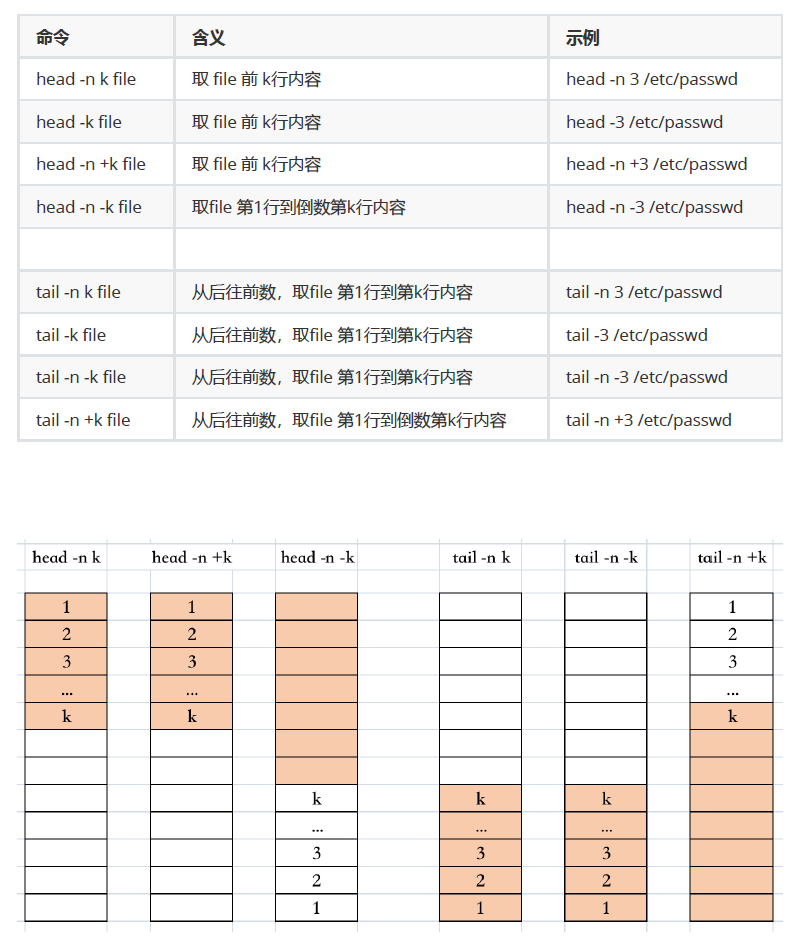
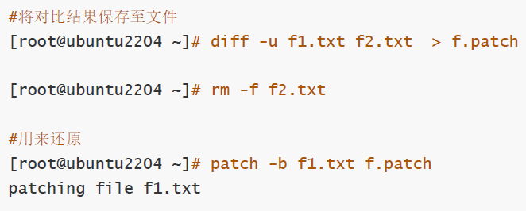

# vi&vim

- 全屏编辑器nano&vi
- 行编辑器sed

```
.当前行 
%全文
d删除
y复制
s查找
g全局替换，默认只替换某行第一个
gc全局替换前确认
i不区分大小写


.vimrc设置vim工作特性


set nu行号
set nonu
set ic忽略大小写
set noic
set ai自动缩进
set noai
set list显示换行符空格和tab
set nolist
set hlsearch高亮搜索
syntax on语法高亮，只在特定文件有效
syntax off
set ff=dos
set ff=unix
set et把tab换成空格
set noet
set ts=N使用N个空格替换tab
set shiftwidth
<< >>
set key=或者X
set查看所有帮助


命令模式
ZZ
ZQ
hljk左右上下切换


w单词间跳转
e跳转下一个单词词尾
b跳转前一个单词词首


H跳转至页首
M跳转至页中
L跳转至页尾


zt当前行移动到屏幕顶
zz当前行移动到屏幕中
zb当前行移动到屏幕底


^跳转行首非空字符
0跳转行首
$跳转行尾


NG
G
gg


(
)


{
}


ctrl+f
ctrl+b
ctrl+d
ctrl+u


x
Nx
xp
~
J


r
R

```

# 文本处理工具

## 文件内容查看命令

```
cat
  -A 显示所有控制符
  -n 编号
  -b 非空行编号
  -s 压缩空行
```

```
nl 相当于cat -n
```

```
tac 行逆向显示文本
rev 行内逆向显示文本
```

```
hexdump 查看非文本文件内容（十六进制）
```

```
more 分页
  -s 压缩空行
空格翻页
回车换号
!cmd执行命令
=显示行号
```

```
less
  -N显示行号
  -s压缩空行
```

```
head
  -c 获取前N字节
  -n 获取前N行，若为-N表示从头到倒数N行
```

```
tail
  -c 获取后N字节
  -n 获取后N行，若为+N表示从头到倒数N行
  -f 追踪新内容
  -F 删除重建继续追踪
```



```
cut
  -b 按字节分割
  -c 按字符分割
  -d"" 指定分割符
  -f 指定显示列 -f1, -f1,2,3, -f 1-3,4
```

```
paste
  -s 合成一行显示（换行变空格）
  -d"" 指定分割符
```

## 分析文本

```
wc 统计
  -l 行数
  -w 单词数
  -c 字节数
  -m 字符数
```

```
sort
  -i 忽略大小写
  -r 倒序
  -u 去重
  -n 按数字大小排序
```

```
uniq
  -c 显示次数
  -r 仅显示重复
  -u 仅显示不重复
```

```
diff
  -u 输出“统一的（unified）”diff格式文件
```

```
patch 还原diff的第二个文件
  -b 备份
```



```
vimdiff 相当于vim -d
```

```
cmp 查看二进制文件的不同
```

# 正则表达式

```
. 任意单个字符
[] 指定范围单个字符
  [lmn] lmn中的任一字符
  [.0-9] .或0到9任一字符
  [0-Z] 任意数字或字符
  [^0-Z] 除字符外其他
  [[:blank:]] 空格
\. 转义表示.本身


* 匹配前面字符任意次
.* 匹配任意多个字符  贪婪模式
\? 匹配0或1个字符
\+ 匹配一个以上字符
\{n\} 匹配至少n次
\{n,m\} 匹配n到m次
\{n,\} 匹配至少n次
\{,m\} 匹配至多m次


^行首锚定
$行尾锚定

```

前向引用引用前面出现的字符而非模式本身

# 扩展正则表达式

```
-E 后无需转义 
```

# 文本处理三剑客

## grep

根据指定模式输出符合条件的行

模式：由正则表达式字符及文本字符编写的过滤条件

```
grep
  -m 3
  -v 取反
  -i 忽略大小写
  -n 显示行号
  -c 显示行数
  -q 静默模式
  -A 显示后两行
  -B 显示前两行
  -C 显示前后两行
  -e 或者
  -f 从文件读取
  -r 不跟随链接
  -R 跟随链接
  -l 显示匹配到的文件名
```

## sed

从文件或管道读取一行，处理一行，存入一行

```
sed
  -n 静默输出
  -E 正则表达式
```

### script格式

```
AddrCmd
  单地址，指定行
    N 具体行号
    $ 最后一行
    /pattern/ 能被匹配到的每一行
  范围地址
    M,N 第M行到第N行
    M,+N 第M行到第M+N行 3,+4 表示从第3行到第7行
    /pattern1/,/pattern2/ 从第一个匹配行开始，到第二个匹配行中间的行
    M,/pattern/ 行号开始，匹配结束
    /pattern/,N 匹配开始，行号结束
  步长
    1~2 奇数行
    2~2 偶数行
  命令
    p 打印当前模式空间内容，追加到默认输出之后
    Ip 忽略大小写输出
    d 删除模式空间匹配的行，并立即启用下一轮循环
    a [\]text 在指定行后面追加文本，支持使用\n实现多行追加
    i [\]text 在行前面插入文本
    c [\]text 替换行为单行或多行文本
```

## awk