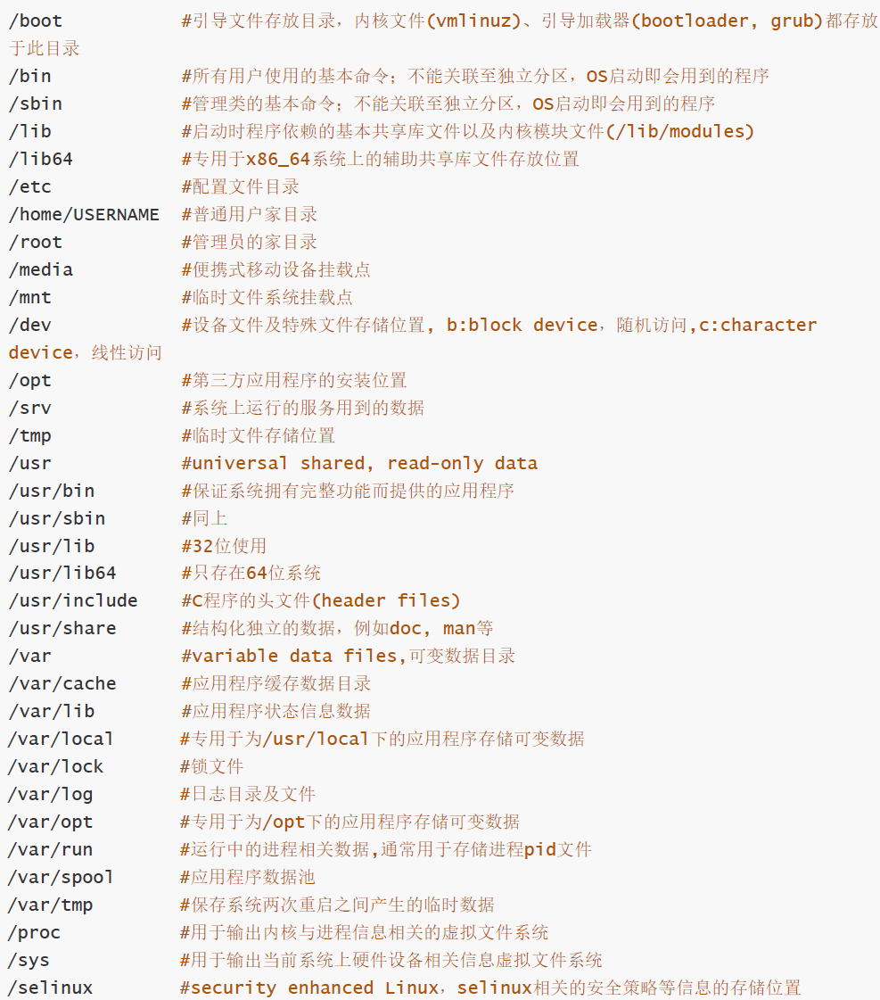
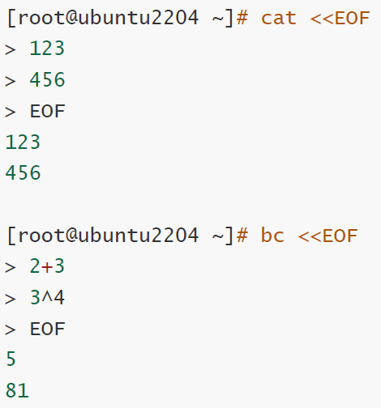
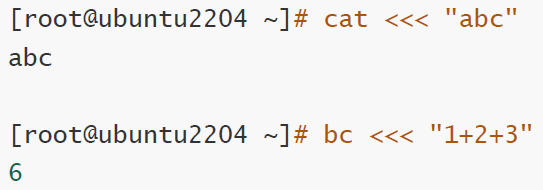
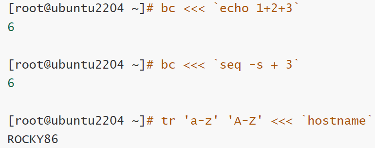
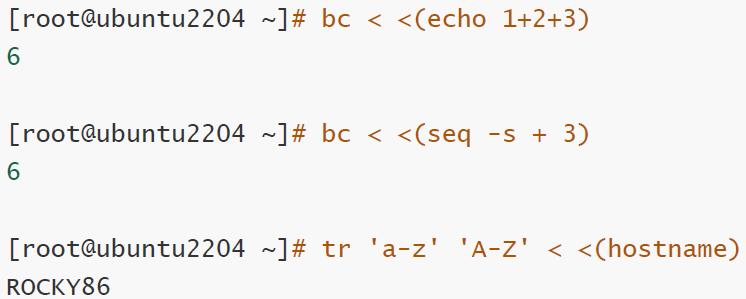

# 4.总结linux文件系统目录结构和目录的功能

## 目录结构

文件系统遵循FHS文件系统层次化标准

单根倒置树结构

/表示根，也用于分隔路径

文件名大小写敏感

.开头为隐藏文件

文件名最长255字节

包含路径最长4095字节

颜色对应

- 蓝色->目录
- 绿色->可执行
- 红色->压缩
- 浅蓝色->链接
- 灰色->其他

除了/和NUL所有字都有效

文件有元数据：metadata即属性和数据：data即文件内容

## 文件系统目录的功能



### ps：目录的功能

目录记录文件名和inode对应关系

# 5.总结文件操作常见的命令和文件夹常见操作和命令

```
stat 显示文件状态
  -f 显示文件系统状态
file 确定文件内容以确定打开方式
ln 创建链接文件
  -s 创建软链接
touch 新建文件或刷新文件时间
mkdir 创建目录
  -p递归创建
rm 删除文件或目录
  -f 强制删除
  -i 删除前询问
  -r 递归删除目录
rmdir 删除目录
  -p 递归删除
cp 复制文件
  -r 递归复制
  -i 覆盖前确认
  -n 不覆盖
  -b 复制前备份
  -v 显示过程
mv 移动文件或重命名
  -i 覆盖前确认
  -n 不覆盖
  -v 显示过程
```

# 6.总结文件元数据相关的知识点，包含硬链接和软连接的区别等知识

## 元数据

文件元数据代表文件属性

inode索引节点存储元数据

磁盘分为两部分，一部分存储inode，一部分存储数据块

目录记录文件名和inode对应关系

文件名->inode->inode表->数据块

***

cp命令：分配空闲inode号，在inode表中生成新条目，在目录创建目录项将名称与inode号关联，拷贝数据块

***

rm命令：释放inode号，将数据块放在空闲列表中，数据没有被实际删除而是后续被覆盖

***

mv命令：在同分区时用新文件名创建目录对应项，删除旧目录条目，不影响inode表或磁盘数据

若跨分区移动相当于cp和rm

## 硬链接 & 软链接

### 硬链接

一个文件两个文件名

使用同一inode号

删除原原文件不会导致硬链接失效

不能给目录创建硬链接，但系统可以创建.和..，因此一个目录的链接数=2+子目录数

### 软链接

通过文件名指向另一个文件

删除原文件会导致软链接失效

可以给目录创建软链接

文件路径相对软链接文件位置

# 7.总结通配符，管道，重定向，并且结合示例，添加注释信息

## 通配符

```
* 匹配0~n个字符
? 匹配一个字符
~ 当前用户家目录
. 当前用户目录
[0-9] 匹配数字
[a-z] 匹配小写字母
[A-Z] 匹配大写字母
[abc] 匹配abc中的一个字符
[^abc] 匹配除abc以外的一个字符

*.txt 匹配所有以 .txt 结尾的文件
file* 匹配所有以 file 开头的文件
f*.log → 匹配以 f 开头并以 .log 结尾的文件
*.* 匹配所有包含 . 的文件
* 匹配当前目录下的所有文件和目录（不包括隐藏文件）

file?.txt 匹配 file 后跟一个字符且为 .txt 的文件
?.log 匹配只有一个字符文件名且为 .log 的文件

file[12].txt 匹配 file1.txt 或 file2.txt
file[A-Za-z].log 匹配范围为所有字母

```

## 重定向

### 标准输出和错误重定向

将标准输入、输出或错误重定向到指定位置

```
COMMAND OPERATOR FILE|DEVICE

> 覆盖写
1> 写标准输出
2> 写标准错误
&> 都写

>> 追加写
1>>
2>>
```

### 标准输入重定向

标准输入 不带参数输入命令后回车若等待输入说明支持标准输入

```
<
```

### 多行重定向

使用"<<终止词"命令从键盘把多行重定向给标准输入



### 高级重定向

```
<<< 
< <()
```

cmd <<< "string" 含义是 here-string ，表示传给给cmd的stdin的内容从这里开始是一个字符串





cmd1 < <(cmd2) 名称为 Process substitution ,由两部分组成

- <(cmd2)表示把cmd2输出写入临时文件
- cmd1 <是输入重定向



## 管道

### 管道

前一条命令输出发给后一条命令做为输入

与套接字的区别是管道是单向，套接字是双向

```
ps aux | grep abc 查找名为abc的进程
seq -s "+" 1 100 | bc 计算1加到100
```
